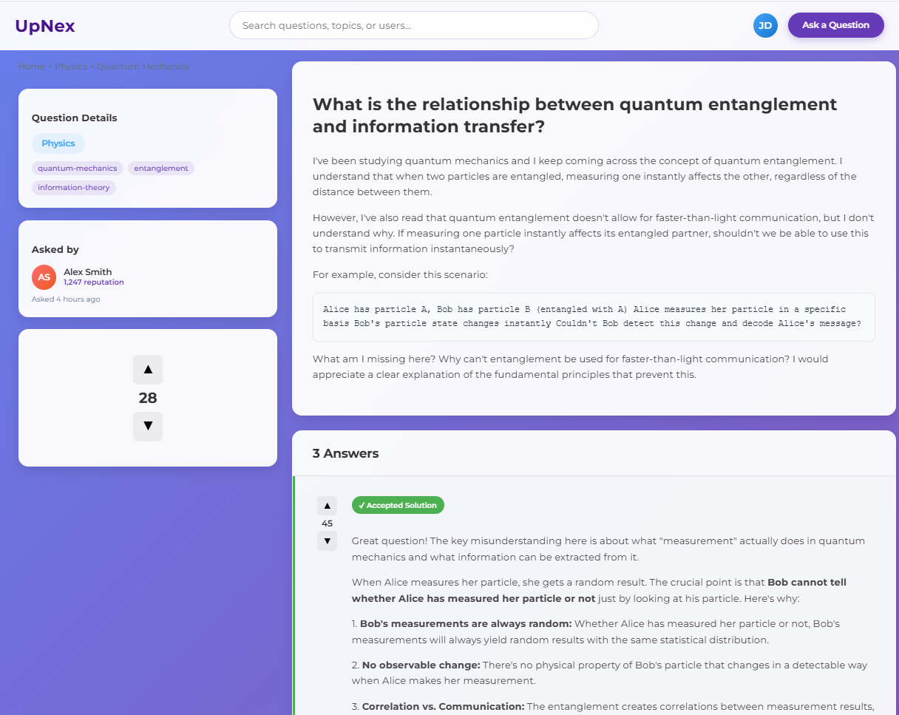
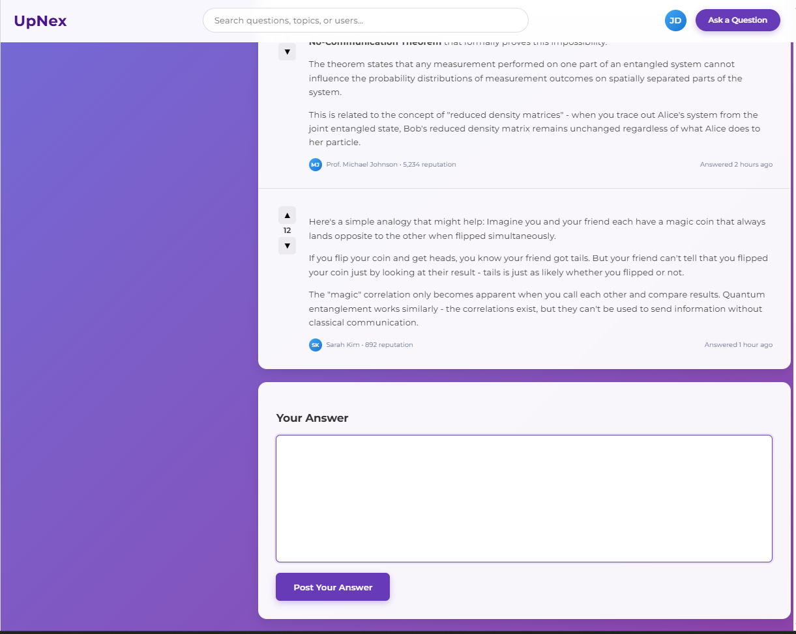

Theme: Use AppTheme palette (PRIMARY #1F6FEB, PRIMARY_DARK #0D3A75, ACCENT #FF7B72, BACKGROUND #F5F7FB, SURFACE #FFFFFF, text colors from theme) and font stack from AppTheme (Segoe UI, 14pt base, bold 18pt headings). Apply rounded corners, soft drop shadows, gradient background similar to mock while respecting theme colors.

Global Layout: Desktop-first responsive grid with three vertical panels of equal height, subtle gradient background, central surface panel with drop shadow. Maintain spacing, paddings, and alignment matching reference mock.

Hero Bar (top)

Left: UpNex logo text using PRIMARY color.
Center: Full-width search bar with placeholder “Search questions, topics, or users…”. Implement lightweight fuzzy search: tokenize title/body/tags, lowercase keywords, count matches, support partial matches using LIKE '%term%' or trigram similarity. Typing filters the center panel list live.
Right: circular avatar/menu icon button; clicking navigates to profile page. Use SURFACE background, PRIMARY border hover states.
Main Content Panels
Goal
ref image:
ref2:
ref 3:
Design a complete Question Answering Page for a web application.
The page should open when a user clicks on a question card from the homepage.
It must include all sections and functionalities described below in detail:

1. Overall Layout

The page should have a two-column structure:

Left side panel: for question details and user information.

Central main area: for displaying the question, answers, and answer input section.

All content should be well-structured with clear spacing and separation between question, answers, and user info.

Ensure the page is responsive and adapts to different screen sizes.

2. Left Side: Question Details Section

A Question Details box should appear at the top-left corner. It should display:

The Subject of the question (e.g., Physics, Math, etc.)

A list of tags related to the question (e.g., quantum mechanics, entanglement, etc.)

Below the Question Details box, display the user information:

A small profile avatar of the user who posted the question.

The username and possibly a short description or activity label.

When another user hovers or clicks on the profile avatar, they should be redirected to that user’s profile page.

Below this, include a question date or post ID section in a small box or label.

3. Main Area: Question Display

At the top center of the page, display:

The Question Title in a bold, prominent font.

Below it, show the question description or body text with proper paragraph spacing.

Directly underneath, show the tags again (as clickable chips/buttons) for easy navigation or filtering of similar questions.

4. Answers Section

Below the question block, create an “Answers” section with the following behavior:

Display all existing answers related to the question.

Each answer card should include:

The answer text/content.

Upvote and Downvote buttons beside or below the text.

A vote count display to show the total number of upvotes.

Answers should be sorted by vote count, with the most upvoted answer displayed first.

When an answer reaches 10 upvotes, mark it as a “Verified Answer” with a small badge or tag.

Below each answer, display:

The profile section of the user who posted the answer — including their avatar, name, and a small clickable link to their profile.

5. Answer Input Area

At the bottom of the answers list, include an Answer Box where logged-in users can type and submit their answers.

The input box should support rich text or multiline input.

Include a “Post Answer” button to submit the response.

Once submitted, the new answer should immediately appear above the answer input box (newest on top).

Each posted answer automatically includes:

The user’s profile info (avatar and name).

Initial upvote count (0 by default).

The ability for other users to upvote or downvote it.

6. Interactivity and Functionality

Click on a question card (from homepage): redirects to this question answering page.

Click on a user avatar: redirects to that user’s profile page.

Upvote/Downvote buttons: dynamically update the vote count without page reload.

Verified Answer logic: when an answer gets 10 or more upvotes, a badge or label appears automatically.

Post Answer button: appends the new answer to the list immediately, preserving layout order.

7. Navigation and Usability

Include a top navigation bar or breadcrumb link to go back to the homepage.

Use consistent alignment for all elements: question → answers → answer input → user info.

Maintain clear distinction between the question and answers visually.

8. Additional Pages (Help & About Page Layouts)

Add “Help” and “About” pages accessible via a menu bar or navigation item.

Only describe the layout and structure (content will be handled by AI later):

Help Page Layout:

A title header “Help & Support” at the top.

Sections for FAQs, Troubleshooting, and Contact Options.

Use clear boxes or cards for each topic.

About Page Layout:

A title “About This Platform” at the top.

Sections for Overview, Features, Team, and Contact Information.

Include placeholders for text and small icons or images.

Use existing JDBC connector jar in lib. Add or confirm JdbcConnectionProvider uses:
URL: jdbc:mysql://127.0.0.1:3306/upnex
User: root
Password: hari
Expose a QuestionRepository.save(Question question) method that handles the transaction described above.
Ensure QuestionRepository uses PreparedStatement with proper Types for NULL subject_id and context.
Update or add tests: src/test/java/.../QuestionRepositoryAddTest.java for happy path and tag handling.

there is jdbc connector jar file in lib directory create a jdbc connection file the connects database: name = upnex, pass = hari, its in 127. local host ip. and also the data that are getting from this page should be present in the user table so make sure to alter according to that

based on the above info create a detailed road map with proper file names and structure in CurrentRoadmap.md make it like [ ] step 1 so its easy to mark as done after implementation

