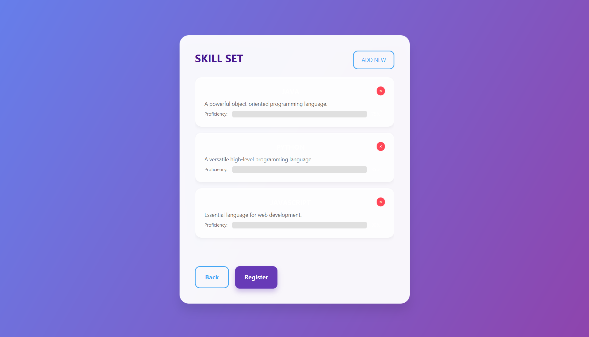

# UpNext Skills Feature User Guide

## Introduction

The UpNext App now features a comprehensive skill management system as part of the user registration process. This guide explains how to use the skills feature, including adding, editing, and managing your professional skills during account creation.

## Skills Registration Flow

### 1. Creating an Account with Skills

When creating a new account in UpNext, you'll now follow a two-step process:

1. **Basic Information**: Enter your name, email, and password
2. **Skills Setup**: Add one or more professional skills to your profile

This enhanced registration flow helps you create a more complete user profile from the start.

### 2. Navigating the Skills Screens

After entering your basic information and clicking "Create Account," you'll automatically be directed to the **Skillset Screen**. From here, you can:

- View your currently added skills
- Add new skills
- Remove skills you no longer want
- Complete your account creation

## Adding Skills

### Using the Add Skill Screen

To add a new skill:

1. Click the **Add New Skill** button on the Skillset Screen
2. Fill in the following information:
   - **Skill Name**: Enter the name of your skill (e.g., "Java Programming")
   - **Description**: Provide a brief description of your experience with this skill
   - **Proficiency Level**: Drag the proficiency bar to indicate your skill level (1-10)
3. Click **Add Skill** to save

#### Tips for Adding Skills

- **Skill Names**: Be specific with skill names (e.g., "React.js Development" rather than just "Web Development")
- **Descriptions**: Include relevant experience, certifications, or years of practice
- **Proficiency Levels**:
  - 1-3: Beginner level
  - 4-7: Intermediate level
  - 8-10: Advanced/Expert level

### Managing Your Skills

On the Skillset Screen, you can:

- **View Skills**: See all the skills you've added
- **Remove Skills**: Click the "×" button on any skill card to delete it
- **Edit Skills**: Currently, editing is not supported - to modify a skill, delete it and add a new one

## Completing Registration

Once you've added at least one skill:

1. The **Create Account** button will become enabled
2. Click this button to finalize your account creation
3. You'll be redirected to the Home Screen with your new account

## Navigation Options

While on the skills screens, you have these navigation options:

- **Back Button**: Returns to the Create Account screen (will ask for confirmation if skills have been added)
- **Cancel Button**: (On Add Skill screen) Returns to the Skillset screen without saving the current skill
- **Add Skill Button**: Saves the current skill and returns to the Skillset screen
- **Create Account Button**: Finalizes account creation with all added skills

## Validation and Constraints

The skills feature includes several validations to ensure data quality:

- **Skill Name**: Required, maximum 100 characters
- **Description**: Optional, maximum 255 characters
- **Proficiency Level**: Must be between 1 and 10
- **At least one skill**: Required to complete registration

If any validation fails, you'll see an error message explaining the issue.

## Visual Feedback

The skills interface provides several forms of visual feedback:

- **Skill Count**: Displays the number of skills you've added
- **Loading Indicators**: Shows when operations are in progress
- **Color-Coded Proficiency**: The proficiency bar changes color based on skill level
- **Confirmation Dialogs**: Appear before potentially destructive actions (like going back)

## Keyboard Navigation

For improved accessibility and efficiency:

- Press **Enter** in the skill name field to jump to the description field
- Press **Enter** in the description field to save the skill
- **Tab** key navigates between form elements
- **Escape** key cancels the current operation (in some contexts)

## Technical Details

Behind the scenes, the skills feature:

- Stores skills in a dedicated `skills` table in the database
- Links skills to user accounts with foreign keys
- Uses proper validation and error handling
- Implements responsive design for different screen sizes

## Tips for Effective Skill Management

1. **Be Honest**: Rate your proficiency level accurately
2. **Be Specific**: Use specific skill names rather than broad categories
3. **Be Concise**: Keep descriptions brief but informative
4. **Be Comprehensive**: Include all relevant professional skills

## Troubleshooting

If you encounter issues:

- **Skills not saving**: Ensure you've clicked the "Add Skill" button completely
- **Cannot complete registration**: Make sure you've added at least one skill
- **Error messages**: Read the specific validation error and correct your input

## Future Enhancements

In upcoming releases, we plan to add:

- Ability to edit existing skills
- Skill categories and tags
- Skill endorsements from other users
- Import skills from professional networking sites
- Skill suggestions based on user profile

---

*Last Updated: October 16, 2025*